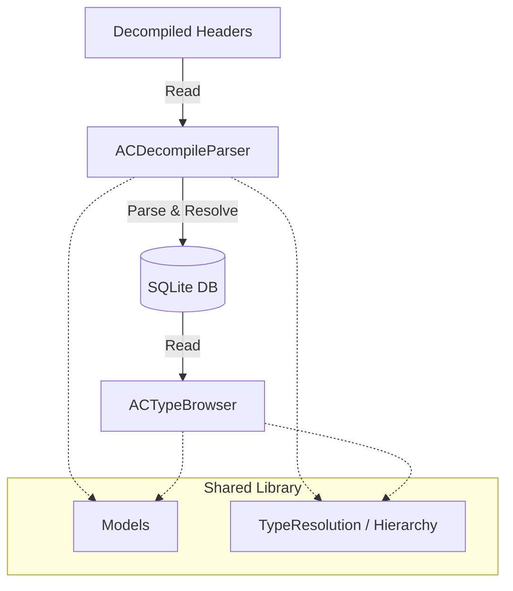
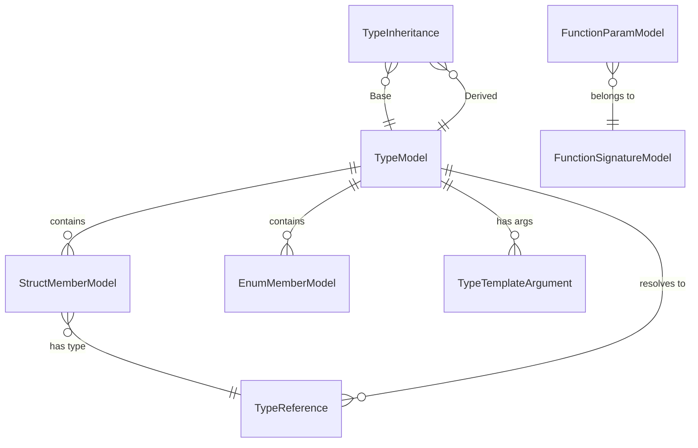

# ACDecompileHallucinator

A robust system for parsing, analyzing, and browsing decompiled C++ type information.

```
# Build types database
dotnet run --project ACDecompileParser -- acclient.c acclient.h --statics-file statics.txt

# generate csharp bindings
dotnet run --project ACDecompileParser csbindings

# generate c headers
dotnet run --project ACDecompileParser headers

# Build hallucinator database (generated comments)
dotnet run --project ACSourceHallucinator --source-db out/types.db --max-tokens 131072 --hallucinator-db out/hallucinator.db --model gpt-oss-20b # --debug-struct Client
```

## Project Overview

ACDecompileHallucinator allows you to ingest raw decompiled header files, resolve complex type relationships (including templates and function pointers), and explore the type hierarchy in a user-friendly web interface.

The solution consists of three main components:

1.  **ACDecompileParser.Shared**: The core library containing the domain model, database logic (SQLite + EF Core), and shared services.
2.  **ACDecompileParser**: A CLI console application that parses raw headers and populates the database.
3.  **ACTypeBrowser**: A Blazor Server web application for searching and browsing the parsed types.
 


## ACDecompileParser (CLI)

The ingestion engine. It scans standard C++ or decompiled header files, parses them into a structured domain model, and resolves cross-references.

### Prerequisites

*   .NET 10 SDK
*   Decompiled header files (e.g., from a reverse engineering tool)

### How to Run

To run the parser against extraction files:

```bash
dotnet run --project ACDecompileParser <path_to_header.h> [--output-dir ./out]
```

Multiple input files can be specified:

```bash
dotnet run --project ACDecompileParser header1.h header2.h --output-dir ./out
```

### Parsing Flow

1.  **Ingestion**: The `SourceParser` reads files and uses regex-based logic to blindly parse structs, enums, and typedefs.
2.  **Resolution**: The `TypeResolutionService` iterates through the parsed text references (e.g., `std::vector<int>*`) and links them to concrete `TypeModel` IDs in the database.
3.  **Offset Calculation**: The `OffsetCalculationService` calculates the memory layout (offsets, padding, alignment) for all structs based on the target architecture rules.
4.  **Export**: Finally, "clean" headers can be regenerated from the structured data.

## ACTypeBrowser (Web App)

A web-based visualizer for the parsed database. It allows deep-linking between types and inspecting complex hierarchies.

### Usage (Docker)

The easiest way to run the browser is via Docker Compose.

1.  Ensure you have parsed data in `./out/types.db`.
2.  Run the compose stack:

```bash
docker compose up --build
```

The app will be available at `http://localhost:5000` (or the port defined in `compose.yaml`).

### Configuration

*   **ACTYPEBROWSER_DB_PATH**: Environment variable to specify the location of the SQLite database within the container (default: `/data/types.db`).

## Database Schema

The project uses a SQLite database managed by Entity Framework Core.

### Key Tables

*   **Types** (`TypeModel`): The central registry for all Structs, Enums, Unions, and TypeDefs.
*   **TypeReferences**: Represents a usage of a type (e.g., a pointer to a struct, or a template argument), identifying properties like `IsPointer`, `IsConst`, and `ArraySize`.
*   **StructMembers** / **EnumMembers**: The actual fields and definition content.
*   **FunctionSignatures**: detailed breakdown of function pointer types.

### ER Diagram



## Development Notes

*   **Database Context**: Located in `ACDecompileParser.Shared/Lib/Storage/TypeContext.cs`.
*   **Parsing Logic**: Regex patterns and parsing state machines are in `ACDecompileParser/Lib/Parser`.
